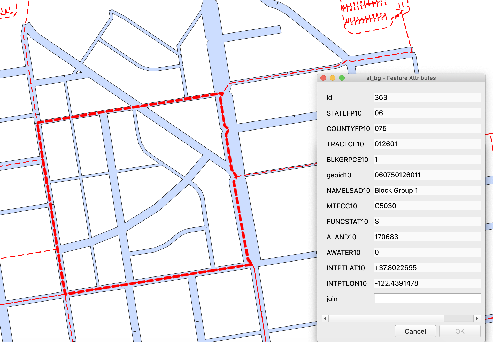
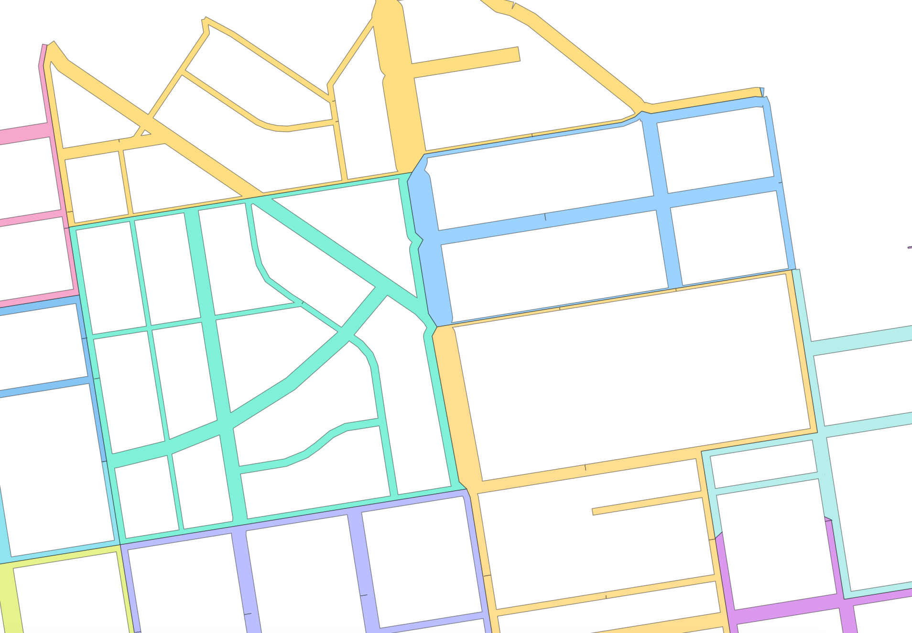

# Social Distancing Density

1. Import SF sidewalk shapefile to the database.

2. Convert the line zones to polygons by making a buffer. Use sidewalk width column as guidance for buffer size.

3. Since the edges of buffered polygons overlap with each other, unionize them.

4. Import Census Block Groups shapefile to the database. This shapefile contains population information.

5. Break the sidewalk polygon, so each census block group has its network of sidewalk. 

6. Calculate the social distancing density for each census block group. Social Distancing Density is the sq.root of total sidewalk area per population density.

