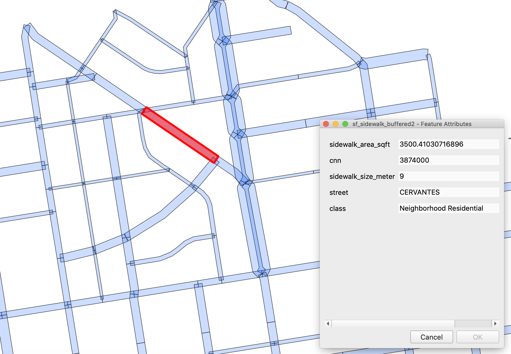

# Social Distancing Density

## Process and Tools

## Sources

**SF Sidewalk**
https://data.sfgov.org/Transportation/Sidewalk-Widths/4g86-grxu

**SF Census Block Groups**
http://opendata.mtc.ca.gov/datasets/-san-francisco-bay-region-2010-census-block-groups-clipped

**SF 2010 Population (By Block Groups)**
http://www.bayareacensus.ca.gov/small/small.htm#blockgroup

**SFMTA GTFS Muni**
https://www.sfmta.com/reports/gtfs-transit-data

**SF Restaurants**
https://data.sfgov.org/Economy-and-Community/Map-of-Registered-Businesses-San-Francisco/9tqe-vdng
Geocoded the address using Geocod.io

**SF Hospitals**
Scrape a list of hospitals in SF using Google Places API.

Note: The shapefile link in the SF 2010 Population website is broken. You will have to join Census Block Groups shapefile with the population information. Otherwise, you can also use census tracts or blocks, instead of block groups.

## Methodology
#### 1. Prepare sidewalk dataset

Import SF sidewalk shapefile to the database.

#### 2. Buffer sidewalk line zones

Use `st_buffer` to convert line zones to polygons. Column `sidewalk_f`, sidewalk width size, is the buffer size.

#### 3. Unionize buffered sidewalk zone

Since the edges of buffered polygons overlap with each other, unionize them using `st_union`.

#### 4. Prepare population dataset 

Import Census Block Groups shapefile and population information to the database. 

#### 5. Split sidewalk polygon

Use `st_intersection` to split sidewalk polygon, so each census block group has its network of sidewalk. 

#### 6. Calculate social distancing density

Calculate social distancing density for each census block group. Social Distancing Density is the square root of sidewalk area per population density `(sq.rt(sidewalk / population)`. Use `st_area` to calculate the sidewalk area. 

#### 7. Enhance the analysis with other datasets

This step is optional. Find the nearest hospital, calculate the number of restaurants, and access to Muni stops.

