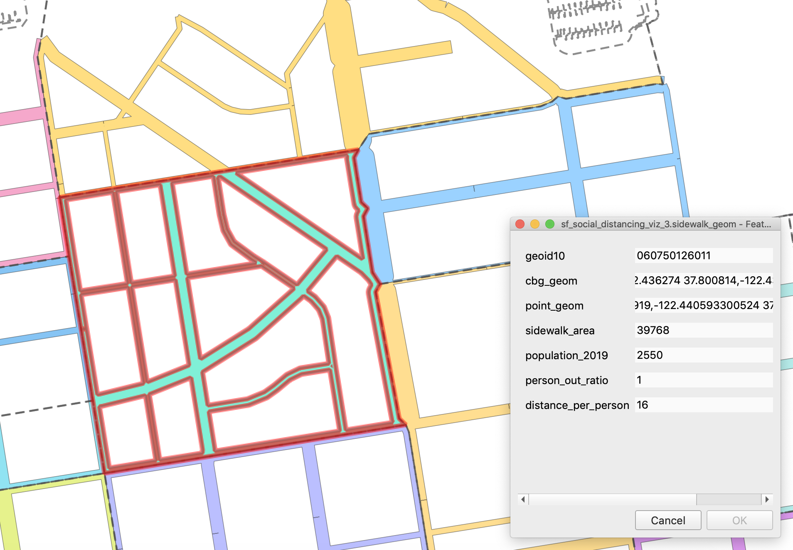

# Social Distancing Density

## See heatmap [here](https://sf-social-distancing.s3-us-west-1.amazonaws.com/index.html)

## Methodology
#### 1. Prepare sidewalk dataset

Import SF sidewalk shapefile to the database.

#### 2. Buffer sidewalk line zones

Use `st_buffer` to convert line zones to polygons. Column `sidewalk_f`, sidewalk width size, is the buffer size.

#### 3. Unionize buffered sidewalk zone

Since the edges of buffered polygons overlap with each other, unionize them using `st_union`.

#### 4. Prepare population dataset 

Import Census Block Groups shapefile and population information to the database. 

#### 5. Split sidewalk polygon

Use `st_intersection` to split sidewalk polygon, so each census block group has its network of sidewalk. 

#### 6. Calculate social distancing density

Calculate social distancing density for each census block group. Social Distancing Density is the square root of sidewalk area per population density `(sq.rt(sidewalk / population)`. Use `st_area` to calculate the sidewalk area. 

